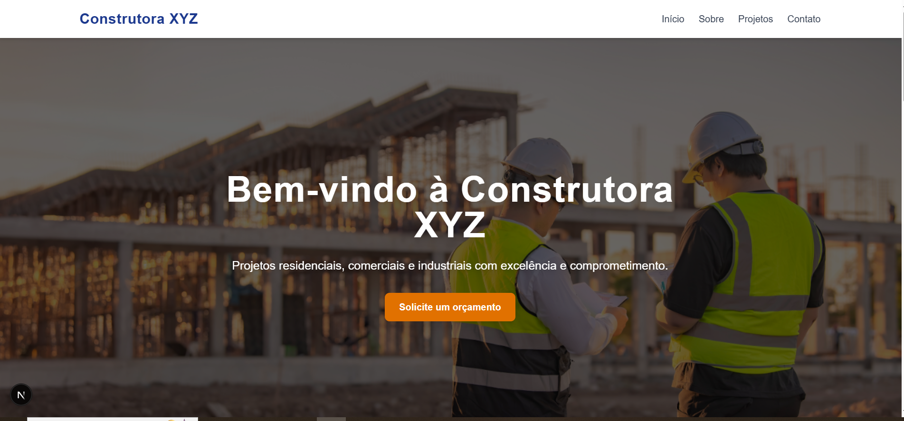
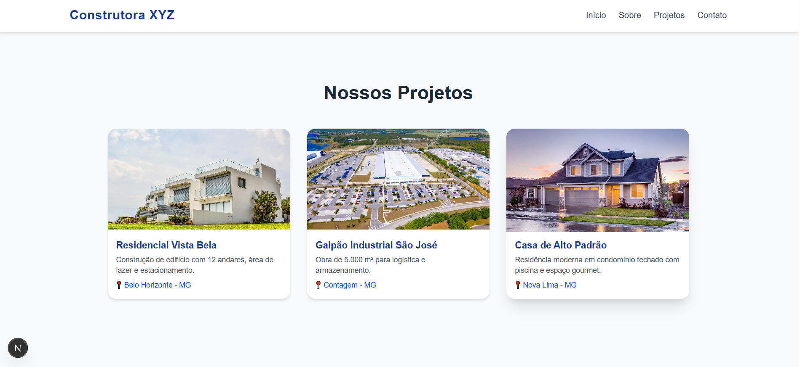

# 🏗️ Site Institucional - Construtora de Engenharia Civil

Website responsivo desenvolvido com **Next.js** para apresentar os serviços, projetos e informações institucionais de uma construtora de engenharia civil. O objetivo é oferecer uma presença online profissional, clara e funcional para atrair e informar clientes.

## 🔗 Link do Projeto

[🔍 Acesse o site aqui](https://seu-dominio-aqui.com)  
[📁 Repositório GitHub](https://github.com/vinisantos2/web-site-engenharia)

## ✨ Funcionalidades

- Página inicial com destaque para serviços e missão da empresa
- Seção "Sobre nós" com informações da construtora
- Listagem de serviços oferecidos
- Galeria de projetos realizados
- Formulário de contato funcional
- Rodapé com informações de contato e redes sociais
- Design responsivo (mobile e desktop)
- Estrutura otimizada para SEO

## 🛠️ Tecnologias Utilizadas

- [Next.js](https://nextjs.org/)
- [React](https://reactjs.org/)
- [TypeScript](https://www.typescriptlang.org/)
- [Tailwind CSS](https://tailwindcss.com/) (ou outra, dependendo do que você usou)
- [React Icons](https://react-icons.github.io/react-icons/) (se usado)
- [EmailJS / Formspree](https://formspree.io/) (caso use para envio de formulários)

## 📸 Imagens do Projeto

| Página | Imagem |
|--------|--------|
| Login / Home |  |

| Projetos |  |


## 🚀 Como rodar o projeto localmente

1. **Clone o repositório**
   ```bash
    git clone https://github.com/vinisantos2/web-site-engenharia.git
    cd web-site-engenharia
    npm install
    npm run dev
web-site-engenharia/
├── public/
│   └── images/
├── src/
│   ├── components/
│   ├── pages/
│   ├── styles/
│   └── ...
├── tsconfig.json
├── tailwind.config.js
└── ...

## 📄 Licença

Este projeto está licenciado sob a Licença MIT - veja o arquivo [LICENSE](LICENSE) para mais detalhes.
